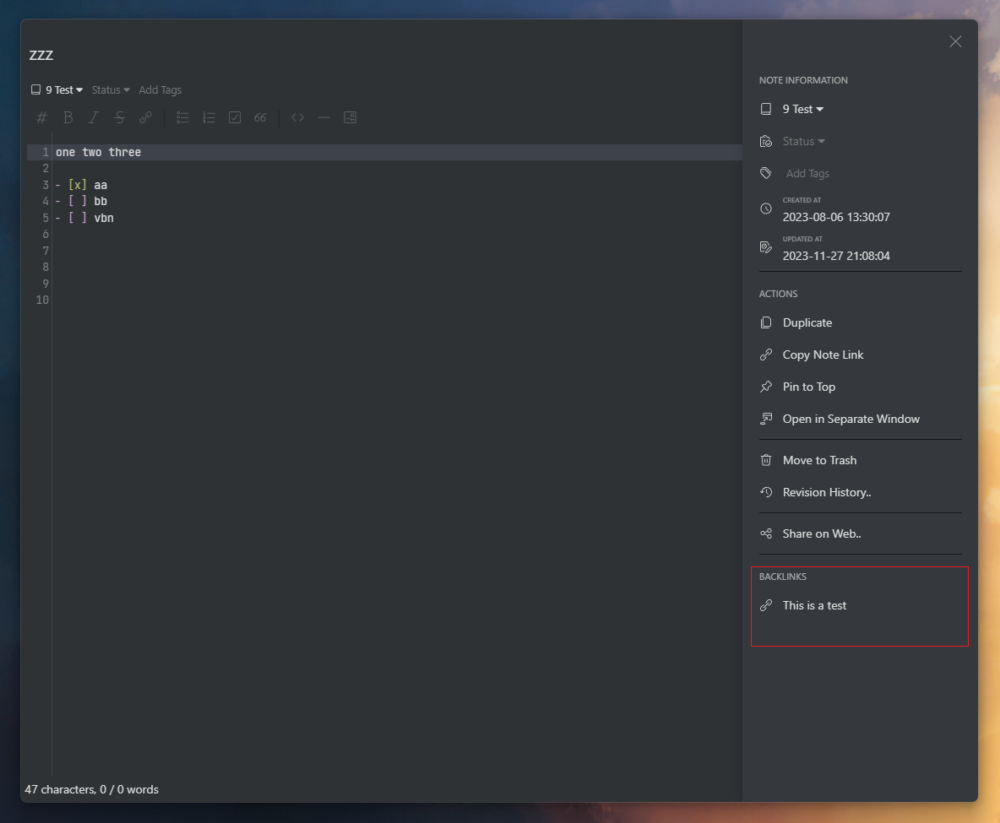
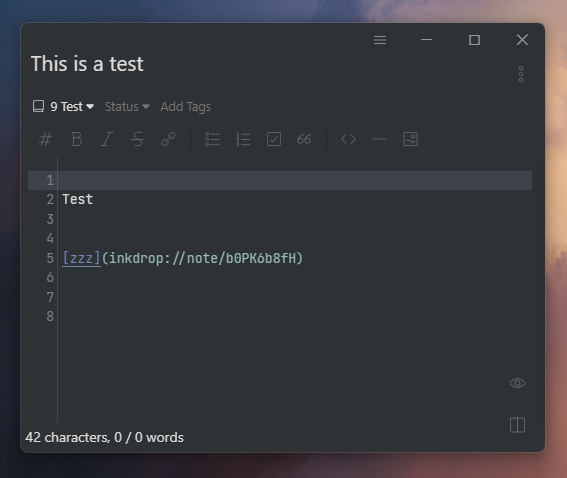

#### In [Inkdrop v5.8.0](https://forum.inkdrop.app/t/inkdrop-desktop-v5-8-0/) this feature was added to the core application. Therefore i have unpublished this plugin from the Inkdrop Plugin registry and archived the repository.

# Backlinks

Just a simple plugin to display backlinks in the editor drawer.

## Usage

Simply open the editor drawer and you should see a list of backlinks.

A backlink is a link to a note that links to the current note.

| Backlink Display | Link Example |
| --- | --- |	
|  |  |


## Install

```bash
ipm install backlinks
```

## Contact

If you have any suggestions for this plugin, feel free to share them with me by opening an [issue on Github](https://github.com/keisir/inkdrop-backlinks/issues).

If you find a bug, you can also submit it to me by opening an [issue on Github](https://github.com/keisir/inkdrop-backlinks/issues).

## Changelog

### 1.0.0 - Initial release
- Display backlinks in the editor drawer
